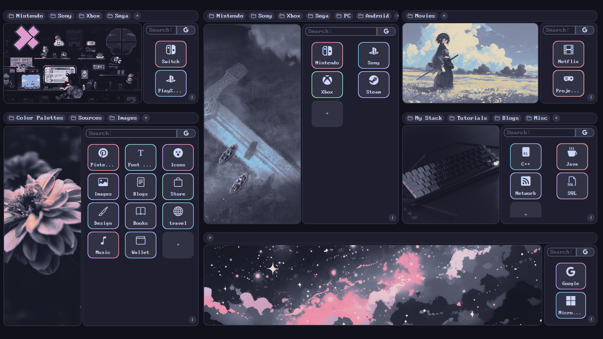
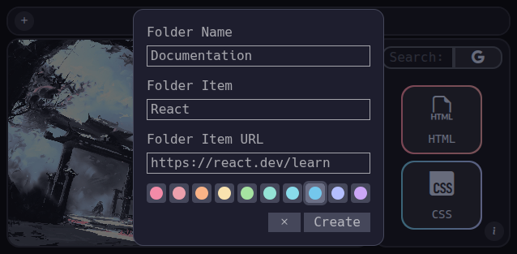
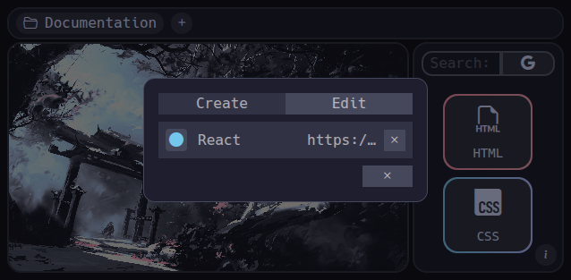
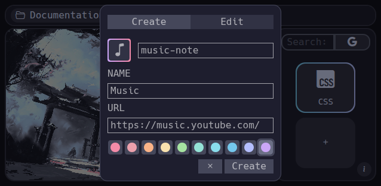
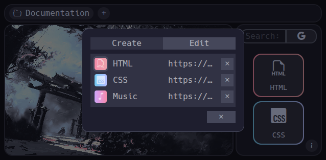
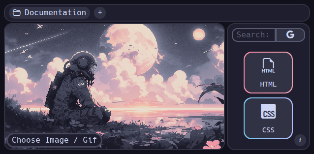
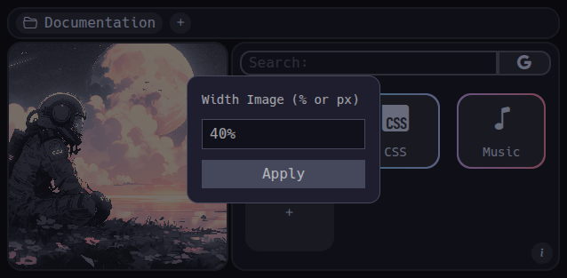
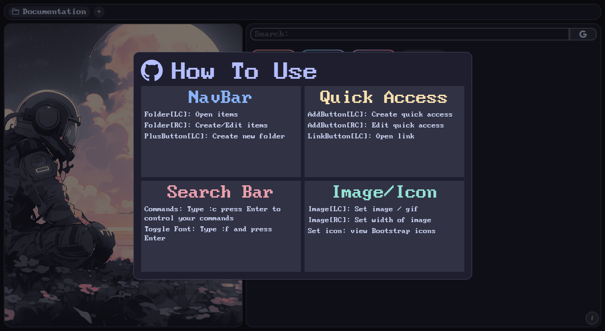

#  ShowCase

#  Discover Tablify

**Tablify** transforms your new tab into a stylish dashboard.  
Group your favorite links into folders, enjoy beautiful quick-access icons, display your own image or GIF, and use customizable search commands — all in one graceful interface.

---

##  Folders

- **Create folders**: Add as many folders as you want to organize your links.
- **Manage folders**: Right-click a folder to add items or edit its content.

---

##  Quick Accesses

- **Add new**: Click the "+" button and choose an icon from <a href="">Bootstrap Icons</a>.
- **Edit**: Click the "+" button > Edit tab, or right-click it to go straight to editing.  
  In the tab edit click any quick access icon to update its style or icon.

---

##  Custom Image

- **Set any image or GIF** as your background by clicking the image icon or your current image.
- **Resize it** by right-clicking the image and entering a custom width (in % or px).

---

## Custom Search Commands

- **Default commands**:
  - `[:c]` – Open the command manager
  - `[:f]` – Toggle font (BigBlueTerm437 By VileR)
  - `[:n]` – Reset to default search

- **Create your own**:  
  Use `:c` to open the command editor. Add a name, the trigger, and the search URL.  
  Example: `YouTube` → trigger: `:y` → URL: `https://www.youtube.com/results?search_query=`

- **Switch engines**: Toggle between Google and Bing with one click.

---

## How to Use

Click the **(i) button** at the bottom-right of the screen to open a quick user guide anytime.

---

##  Suport

I reallly apreciate if you want support this project :)

